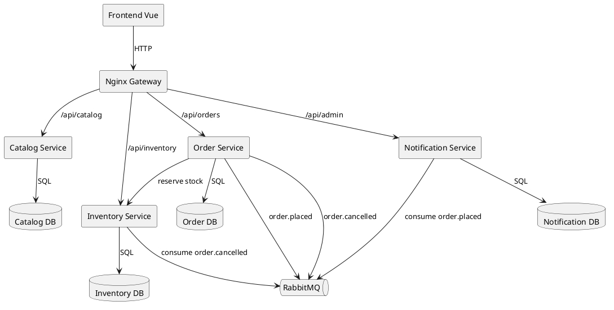

# Suilens Branch Inventory Assignment

## Menjalankan sistem

```
docker compose up --build -d
```

Setelah semua service sehat, frontend tersedia di `http://localhost:5173`.

## Layanan dan port

- Catalog Service: `http://localhost:3001`
- Order Service: `http://localhost:3002`
- Notification Service: `http://localhost:3003`
- Inventory Service: `http://localhost:3004`
- RabbitMQ UI: `http://localhost:15672`
- API Gateway: `http://localhost:8080`

## Kontrak API utama

- `GET /api/inventory/lenses/:lensId`
- `POST /api/inventory/reserve`
- `PATCH /api/orders/:id/cancel`

## Seed data

- Lensa tersedia otomatis saat startup
- Inventaris tersebar di tiga cabang: KB-JKT-S, KB-JKT-E, KB-JKT-N

## Diagram arsitektur



## Bonus: DLQ, Gateway, Replay

- DLQ exchange: `suilens.dlq` dengan queue `suilens.dlq`
- Admin DLQ: `GET http://localhost:8080/api/admin/dlq?limit=10`
- Replay notifikasi: `POST http://localhost:8080/api/admin/notifications/replay?from=2025-01-01T00:00:00Z`
- Frontend memakai gateway sebagai base URL (`VITE_API_BASE=http://localhost:8080`)

## Tulisan perbandingan
Lihat `d3.md`.
