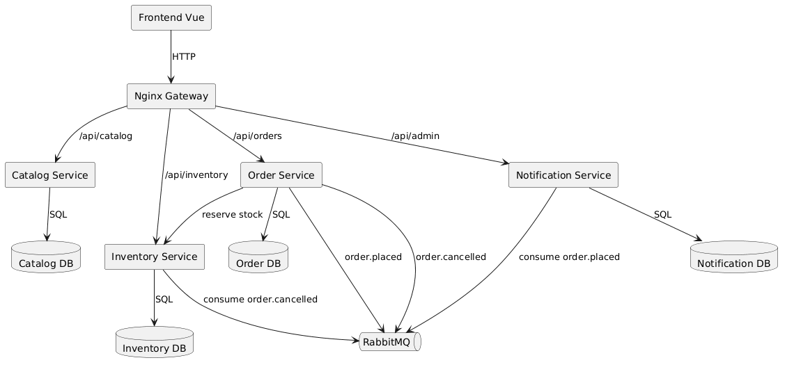

# Suilens Branch Inventory Assignment

## Menjalankan sistem

```
docker compose up --build -d
```

Setelah semua service sehat, frontend tersedia di `http://localhost:5173`.

## Layanan dan port

- Catalog Service: `http://localhost:3001`
- Order Service: `http://localhost:3002`
- Notification Service: `http://localhost:3003`
- Inventory Service: `http://localhost:3004`
- RabbitMQ UI: `http://localhost:15672`
- API Gateway: `http://localhost:8080`

## Kontrak API utama

- `GET /api/inventory/lenses/:lensId`
- `POST /api/inventory/reserve`
- `PATCH /api/orders/:id/cancel`

## Seed data

- Lensa tersedia otomatis saat startup
- Inventaris tersebar di tiga cabang: KB-JKT-S, KB-JKT-E, KB-JKT-N

## Diagram arsitektur



## API docs

Base URL:

- Gateway: `http://localhost:8080`
- Direct: `http://localhost:3001` (catalog), `http://localhost:3002` (orders), `http://localhost:3004` (inventory), `http://localhost:3003` (notification admin)

### Catalog Service

`GET /api/catalog/lenses`

Response 200:

```json
[
  {
    "id": "11111111-1111-1111-1111-111111111111",
    "modelName": "FE 24-70mm F2.8 GM II",
    "manufacturerName": "Sony",
    "minFocalLength": 24,
    "maxFocalLength": 70,
    "maxAperture": "2.8",
    "mountType": "Sony E",
    "dayPrice": "250000.00",
    "weekendPrice": "600000.00",
    "description": "The Sony FE 24-70mm F2.8 GM II is a fast, versatile zoom lens."
  }
]
```

`GET /api/catalog/lenses/:id`

Response 200:

```json
{
  "id": "11111111-1111-1111-1111-111111111111",
  "modelName": "FE 24-70mm F2.8 GM II",
  "manufacturerName": "Sony",
  "minFocalLength": 24,
  "maxFocalLength": 70,
  "maxAperture": "2.8",
  "mountType": "Sony E",
  "dayPrice": "250000.00",
  "weekendPrice": "600000.00",
  "description": "The Sony FE 24-70mm F2.8 GM II is a fast, versatile zoom lens."
}
```

### Inventory Service

`GET /api/inventory/lenses/:lensId`

Response 200:

```json
[
  {
    "branchCode": "KB-JKT-S",
    "branchName": "Kebayoran Baru",
    "branchAddress": "Jakarta Selatan",
    "availableQuantity": 4,
    "totalQuantity": 4
  }
]
```

`POST /api/inventory/reserve`

Request:

```json
{
  "orderId": "00000000-0000-0000-0000-000000000000",
  "lensId": "11111111-1111-1111-1111-111111111111",
  "branchCode": "KB-JKT-S",
  "quantity": 1
}
```

Response 200:

```json
{
  "status": "reserved",
  "reservation": {
    "orderId": "00000000-0000-0000-0000-000000000000",
    "lensId": "11111111-1111-1111-1111-111111111111",
    "branchCode": "KB-JKT-S",
    "quantity": 1,
    "reservedAt": "2026-03-05T00:00:00.000Z",
    "releasedAt": null
  }
}
```

Response 409:

```json
{ "error": "Insufficient stock for selected branch" }
```

### Order Service

`POST /api/orders`

Request:

```json
{
  "customerName": "Test",
  "customerEmail": "test@example.com",
  "lensId": "11111111-1111-1111-1111-111111111111",
  "branchCode": "KB-JKT-S",
  "startDate": "2025-01-10",
  "endDate": "2025-01-12"
}
```

Response 201:

```json
{
  "id": "00000000-0000-0000-0000-000000000000",
  "customerName": "Test",
  "customerEmail": "test@example.com",
  "lensId": "11111111-1111-1111-1111-111111111111",
  "branchCode": "KB-JKT-S",
  "lensSnapshot": {
    "dayPrice": "250000.00",
    "modelName": "FE 24-70mm F2.8 GM II",
    "manufacturerName": "Sony"
  },
  "startDate": "2025-01-10T00:00:00.000Z",
  "endDate": "2025-01-12T00:00:00.000Z",
  "totalPrice": "500000.00",
  "status": "confirmed",
  "createdAt": "2026-03-05T00:00:00.000Z"
}
```

`PATCH /api/orders/:id/cancel`

Response 200:

```json
{
  "id": "00000000-0000-0000-0000-000000000000",
  "status": "cancelled"
}
```

### Notification Admin

`GET /api/admin/dlq?limit=10`

Response 200:

```json
{
  "count": 1,
  "messages": [
    {
      "routingKey": "order.placed",
      "headers": { "x-retry": 3 },
      "payload": {
        "event": "order.placed",
        "timestamp": "2026-03-05T00:00:00.000Z",
        "data": {
          "orderId": "00000000-0000-0000-0000-000000000000",
          "customerName": "Test",
          "customerEmail": "test@example.com",
          "lensName": "FE 24-70mm F2.8 GM II"
        }
      }
    }
  ]
}
```

`POST /api/admin/notifications/replay?from=2026-03-05T00:00:00Z`

Response 200:

```json
{ "processed": 1, "inserted": 1 }
```

## Bonus: DLQ, Gateway, Replay

- DLQ exchange: `suilens.dlq` dengan queue `suilens.dlq`
- Admin DLQ: `GET http://localhost:8080/api/admin/dlq?limit=10`
- Replay notifikasi: `POST http://localhost:8080/api/admin/notifications/replay?from=2025-01-01T00:00:00Z`
- Frontend memakai gateway sebagai base URL (`VITE_API_BASE=http://localhost:8080`)
