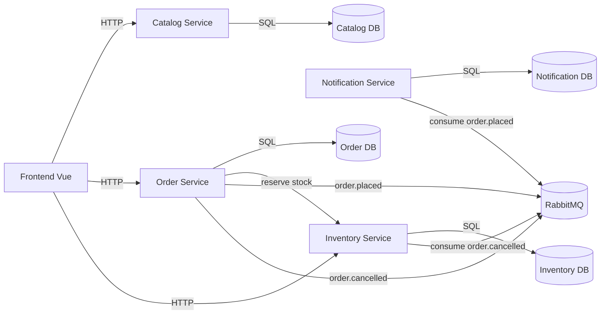

# Suilens Branch Inventory Assignment

## Menjalankan sistem

```
docker compose up --build -d
```

Setelah semua service sehat, frontend tersedia di `http://localhost:5173`.

## Layanan dan port

- Catalog Service: `http://localhost:3001`
- Order Service: `http://localhost:3002`
- Notification Service: `http://localhost:3003`
- Inventory Service: `http://localhost:3004`
- RabbitMQ UI: `http://localhost:15672`

## Kontrak API utama

- `GET /api/inventory/lenses/:lensId`
- `POST /api/inventory/reserve`
- `PATCH /api/orders/:id/cancel`

## Seed data

- Lensa tersedia otomatis saat startup
- Inventaris tersebar di tiga cabang: KB-JKT-S, KB-JKT-E, KB-JKT-N

## Diagram arsitektur



## Tulisan perbandingan

### (a) Skenario mikroservis lebih tangguh
Misalkan ada kampanye besar yang memicu lonjakan event notifikasi dan menyebabkan Notification Service overload, bahkan crash berulang. Pada arsitektur mikroservis, jalur utama pemesanan tetap berjalan karena Order Service hanya bergantung pada Catalog Service dan Inventory Service untuk proses inti. Event `order.placed` disimpan di RabbitMQ dan akan diproses ketika Notification Service kembali sehat, sehingga kegagalan tidak merembet ke layanan inti. Sistem tetap menerima pesanan dan mengalokasikan stok, sementara notifikasi bersifat eventual. Ini menunjukkan isolasi kegagalan yang lebih baik dibanding monolit, di mana modul notifikasi yang berat bisa menurunkan performa transaksi inti atau bahkan membuat aplikasi tidak responsif.

Contoh lain adalah lonjakan pada pencarian katalog. Jika Catalog Service memerlukan scaling terpisah, ia bisa di-scale tanpa menambah beban pada Order Service atau Inventory Service. Kapasitas bisa dinaikkan secara terfokus. Dalam monolit, scaling harus dilakukan untuk seluruh aplikasi, yang membuat biaya lebih tinggi dan lebih sulit mengendalikan latensi di bagian yang kritis.

### (b) Skenario monolit lebih sederhana
Pada skenario sederhana seperti validasi lintas data sebelum transaksi, monolit lebih sederhana karena semua data berada pada satu basis data dan bisa dikelola dalam satu transaksi ACID. Misalnya, saat menghitung harga total, memvalidasi diskon, dan memeriksa stok, monolit cukup melakukan satu transaksi yang mencakup semua tabel terkait. Jika ada kegagalan, transaksi dapat di-roll back secara atomik.

Di mikroservis, tindakan ini harus dipecah ke beberapa layanan. Order Service harus memanggil Catalog Service untuk harga dan Inventory Service untuk stok, lalu menyusun hasilnya. Jika salah satu layanan lambat atau tidak tersedia, alur transaksi menjadi kompleks dan membutuhkan retry, timeout, serta mekanisme kompensasi. Untuk tim kecil dan domain sederhana, monolit jauh lebih cepat dibangun dan lebih mudah dipahami, sehingga mengurangi biaya koordinasi dan debugging.

### (c) Inventory Service down saat pemesanan
Jika Inventory Service down, Order Service tidak bisa melakukan reservasi stok secara sinkron, sehingga pemesanan harus ditolak dengan error yang jelas. Ini menjaga konsistensi karena Order Service tidak membuat pesanan tanpa stok yang dikunci. Mitigasi utama adalah circuit breaker untuk mencegah retry berlebihan dan memberikan feedback cepat ke pengguna, ditambah timeout yang ketat pada pemanggilan inventory.

Mitigasi tambahan yang mungkin adalah mode antrian pesanan: Order Service menerima pesanan dalam status pending dan menaruhnya ke queue untuk diproses ulang ketika Inventory Service kembali sehat. Namun, pendekatan ini memperkenalkan trade-off pengalaman pengguna karena pesanan tidak langsung terkonfirmasi. Untuk kasus yang membutuhkan konfirmasi instan dan konsistensi stok yang kuat, penolakan sementara adalah pilihan yang lebih aman. Untuk kasus yang lebih fleksibel, pendekatan antrian dapat meningkatkan ketersediaan.

### (d) Trade-off dan alternatif
Trade-off utama adalah konsistensi vs ketersediaan. Pada desain ini, reservasi stok dilakukan secara sinkron demi konsistensi, sementara pembatalan dilakukan secara asinkron agar sistem tetap responsif dan tidak bergantung pada jalur balik secara real time. Ini membuat alur pembatalan sedikit lebih kompleks karena membutuhkan idempotensi di Inventory Service, tetapi memberi fleksibilitas ketika terjadi gangguan sementara.

Alternatifnya adalah menyimpan stok di Order Service untuk mengurangi latensi jaringan. Pendekatan ini menyederhanakan transaksi, tetapi mengorbankan pemisahan tanggung jawab dan meningkatkan coupling. Alternatif lain adalah shared database untuk semua layanan. Ini memudahkan konsistensi data namun menabrak prinsip isolasi mikroservis dan membuat perubahan skema lebih berisiko.

Pendekatan lain yang lebih advance adalah menggunakan event sourcing atau log-based system seperti Kafka untuk mengelola stok dengan replay dan kompensasi yang lebih kuat. Ini meningkatkan auditability dan robustness, tetapi biaya operasional serta kompleksitas implementasinya jauh lebih tinggi dibanding kebutuhan sistem ini.
