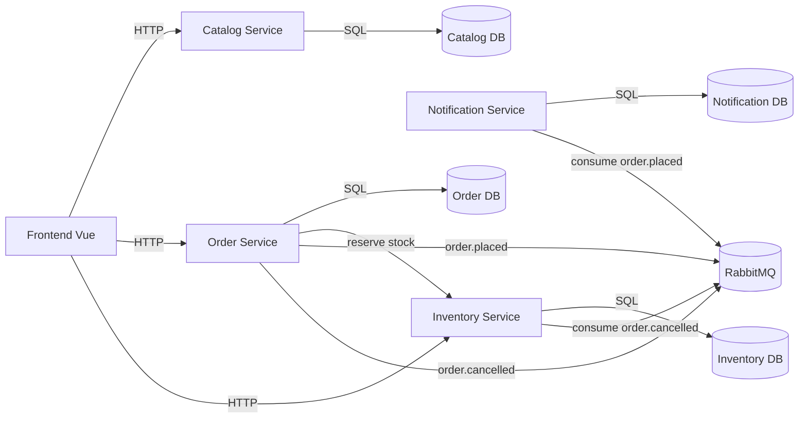

# Suilens Branch Inventory Assignment

## Menjalankan sistem

```
docker compose up --build -d
```

Setelah semua service sehat, frontend tersedia di `http://localhost:5173`.

## Layanan dan port

- Catalog Service: `http://localhost:3001`
- Order Service: `http://localhost:3002`
- Notification Service: `http://localhost:3003`
- Inventory Service: `http://localhost:3004`
- RabbitMQ UI: `http://localhost:15672`

## Kontrak API utama

- `GET /api/inventory/lenses/:lensId`
- `POST /api/inventory/reserve`
- `PATCH /api/orders/:id/cancel`

## Seed data

- Lensa tersedia otomatis saat startup
- Inventaris tersebar di tiga cabang: KB-JKT-S, KB-JKT-E, KB-JKT-N

## Diagram arsitektur



## Tulisan perbandingan

### (a) Skenario mikroservis lebih tangguh
Saat lonjakan trafik di fitur notifikasi (misalnya kampanye promosi) menyebabkan Notification Service overload, Order Service tetap bisa memproses pesanan karena jalur utama reservasi stok bersifat sinkron dan terpisah dari alur notifikasi. Event `order.placed` tetap masuk ke RabbitMQ dan diproses saat Notification Service pulih, tanpa menghentikan alur pemesanan.

### (b) Skenario monolit lebih sederhana
Untuk validasi lintas data seperti memastikan harga, diskon, dan stok terkini sebelum transaksi, monolit lebih sederhana karena semua data berada dalam satu transaksi database. Di mikroservis, koordinasi antar layanan memerlukan pemanggilan jaringan dan pola saga, sehingga lebih kompleks untuk memastikan konsistensi kuat.

### (c) Inventory Service down saat pemesanan
Order Service akan gagal melakukan reservasi stok dan mengembalikan error ke pengguna. Mitigasi yang masuk akal: circuit breaker dan retry terukur, fallback pesan yang jelas, serta mekanisme antrian pesanan untuk diproses ulang ketika Inventory Service kembali sehat. Untuk sistem yang lebih ketat, bisa menolak pesanan sampai stok bisa diverifikasi.

### (d) Trade-off dan alternatif
Trade-off utama adalah konsistensi vs ketersediaan. Sistem ini memilih konsistensi stok per cabang untuk pemesanan dengan memanggil Inventory Service secara sinkron, tetapi pembatalan dilakukan secara asinkron agar sistem tetap responsif. Alternatifnya adalah menyimpan stok di Order Service (mengurangi jaringan) atau menggunakan database terdistribusi/shared DB, namun itu mengurangi isolasi layanan dan meningkatkan coupling.
